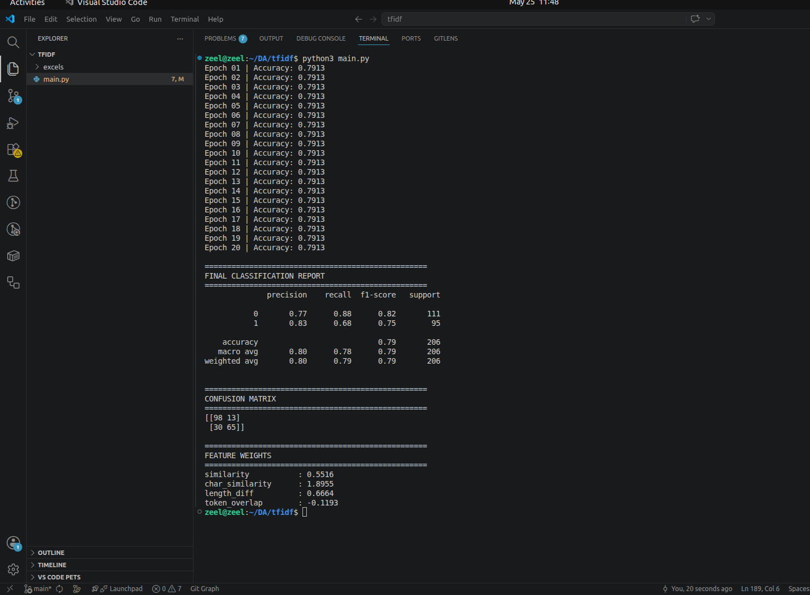

# Text Similarity Classifier using TF-IDF and Feature Engineering

A machine learning project that classifies whether two category names refer to the same concept using classical NLP techniques and handcrafted similarity features — without embeddings or transformers.

---

## Project Overview

This project focuses on solving a real-world taxonomy/category matching problem often seen in e-commerce platforms.

Example:

| Category A | Category B | Match |
|---|---|
| Men's Running Shoes | Shoes for Men Running | ✅ |
| Mobile Chargers | Kitchen Containers | ❌ |

Instead of relying on large pretrained language models, this project explores how far classical NLP and feature engineering can go using:
- TF-IDF
- Cosine Similarity
- Character N-Grams
- SGD-based classification

---

## Features Engineered

### 1. Word-Level TF-IDF Cosine Similarity
Captures lexical overlap using:
- unigrams
- bigrams

Helps identify semantically close phrases with shared important terms.

Example:
- "running shoes"
- "sports shoes"

---

### 2. Character N-Gram TF-IDF Similarity
Uses character-level TF-IDF with 3–5 character windows.

Benefits:
- typo handling
- spelling variations
- morphological similarity

Example:
- "running"
- "runner"

---

### 3. Length Difference
Absolute difference in string lengths between category pairs.

Useful because:
- drastically different lengths often indicate unrelated categories.

---

### 4. Token Overlap Count
Counts the number of shared tokens between both cleaned category names.

Simple but highly informative feature.

---

## Why TF-IDF?

TF-IDF helps assign higher importance to informative words while reducing the impact of extremely common words.

Common terms like:
- "for"
- "and"
- "the"

receive lower weights automatically.

Important domain-specific terms receive higher weights.

---

## Tech Stack

- Python
- Pandas
- Scikit-learn
- TF-IDF Vectorizer
- SGDClassifier
- NumPy

---

## ML Pipeline

```text
Raw Excel Dataset
        ↓
Text Cleaning
        ↓
TF-IDF Vectorization
        ↓
Feature Engineering
        ↓
Similarity Features
        ↓
Feature Scaling
        ↓
SGDClassifier Training
        ↓
Evaluation Metrics
```

---

## Training & Evaluation

The model was trained using an SGDClassifier with log-loss optimization.

Evaluation metrics include:
- Accuracy
- Precision
- Recall
- F1 Score
- Confusion Matrix

### Model Performance

- Accuracy: ~79%
- Precision: ~0.83
- Recall: ~0.68
- F1 Score: ~0.75

---

## Training Screenshot



---

## Key Learnings

- Classical NLP techniques are still highly effective.
- Character n-grams significantly improve lexical similarity detection.
- Feature scaling impacts optimization convergence.
- Handcrafted features can perform surprisingly well without transformers or embeddings.

---

## Future Improvements

Planned upgrades:
- Sentence Embeddings
- SBERT / Sentence Transformers
- FAISS Vector Search
- Hybrid Lexical + Semantic Retrieval
- Hard Negative Mining

---

## Installation

```bash
pip3 install -r requirements.txt
```

---

## Run Project

```bash
python3 main.py
```

---

## Author

Zeel Parmar
